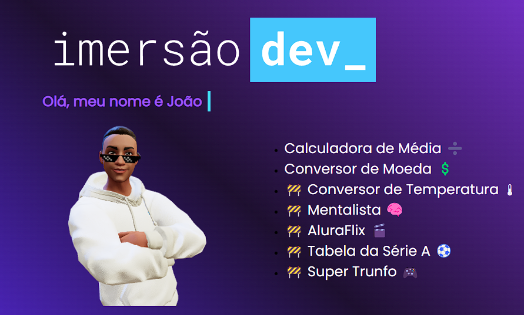
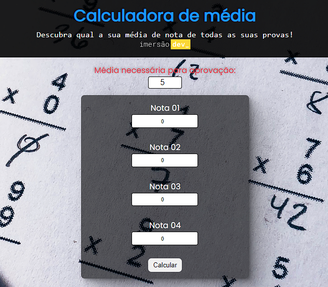
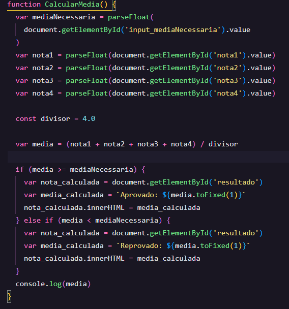
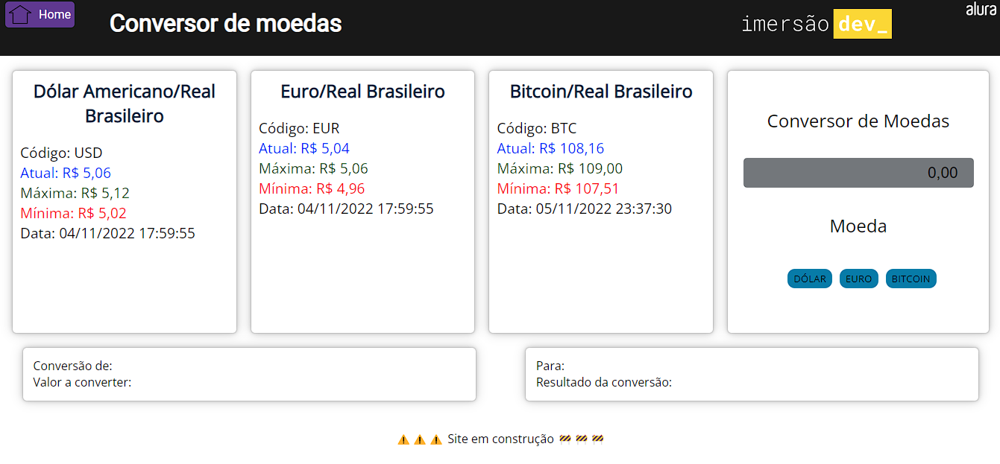
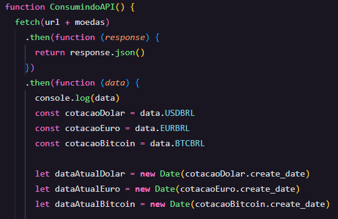

 <a href="#sobre">Sobre</a> •
 <a href="#tecnologias">Tecnologias</a> • 
 <a href="#autor">Autor</a> 

# Sobre

Biblioteca de projetos desenvolvidos na Imersão DEV da Alura.

# Tecnologias

• HTML 

• CSS

• JavaScript

# 1- Calculadora de Média

Calcula a média de 4 notas , com a média mínima podendo ser alterada.

# 2- Conversor de Moedas

Converte Moedas em Real para Dolar, Euro e Bitcoin.

Feita Usando a API AwesomeAPI, com Update Automático das cotações das moedas.

<a href="https://docs.awesomeapi.com.br/api-de-moedas" >https://docs.awesomeapi.com.br/api-de-moedas</a>

⚠️⚠️ Mais projetos em breve ⚠️⚠️

# Autor

Dev: João Marcos Melo

E-mail: jmmsp2003@hotmail.com

Tel:(75)98827-5212 (whatsapp)

